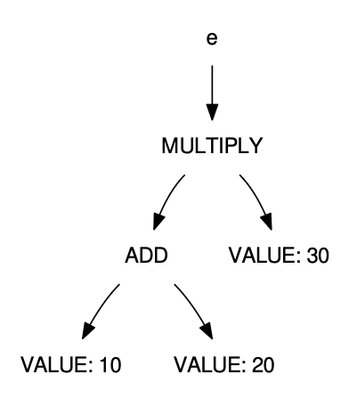

# 5. Parsing in Practice


5.1 The Bison Parser Generator

```
%{
(C preamble code)
%}

(declarations)

%%

(grammar rules)

%%

(C code)
```

5.2 Avaliador

```
%{
#include <stdio.h>
%}

%token TOKEN_INT
%token TOKEN_PLUS
%token TOKEN_MINUS
%token TOKEN_MUL
%token TOKEN_DIV
%token TOKEN_LPAREN
%token TOKEN_RPAREN
%token TOKEN_SEMI
%token TOKEN_ERROR

%%
program : expr TOKEN_SEMI;

expr : expr TOKEN_PLUS term
| expr TOKEN_MINUS term
| term
;

term : term TOKEN_MUL factor
| term TOKEN_DIV factor
| factor
;

factor: TOKEN_MINUS factor
| TOKEN_LPAREN expr TOKEN_RPAREN
| TOKEN_INT
;

%%
```


5.3 Interpretador de Expressões

Para fazer mais do que simplesmente validar o programa, precisamos usar ações semânticas embutidas na própria gramática. Após o lado direito
de qualquer regra de produção, você pode inserir código C arbitrário entre chaves.
Este código pode se referir a valores semânticos que representam 
os valores já calculados para outros não-terminais. 
Os valores semânticos são indicados por
cifrões que apontam a posição de um não-terminal em uma regra de produção.
Dois cifrões indicam o valor semântico da regra atual.

Por exemplo, na regra de adição, a ação semântica apropriada é
adicionar o valor da esquerda (o primeiro símbolo) ao valor da direita 
(o terceiro símbolo):

```
expr : expr TOKEN_PLUS term { $$ = $1 + $3; } 
```

De onde vêm os valores semânticos $1 e $3? Eles simplesmente
vêm das outras regras que definem esses não-terminais. 
Eventualmente, chegamos a uma regra que fornece o valor para um nó folha. 
Por exemplo, esta regra indica que o valor semântico de um token inteiro é o valor inteiro do texto do token:

```
// lexer
[0-9]+  { yylval = atoi(yytext); return TOKEN_INT; }

// parser
factor : TOKEN_INT { $$ = $1; }
```

- Ação _default_ para regra com um símbolo à direita:

```term : factor { $$ = $1; } ``` 

Como o Bison gera um  analisador sintático bottom-up, 
ele determina os valores semânticos dos nós-folha na árvore 
sintática primeiro, depois os passa para os nós internos 
e assim por diante,  até que o resultado chegue ao símbolo inicial.

```
// parser

prog : expr TOKEN_SEMI { parser_result = $1; }
...
expr: expr '+' term { $$ = $1 + $3; }
...
term: term '*' factor { $$ = $1 * $3; }
...
factor : TOKEN_INT { $$ = $1; }
```

O programa principal simplesmente invoca yyparse(). 
Se bem-sucedido, o resultado é armazenado na variável global 
"parser_result"  para extração e uso a partir do programa principal.

5.4 Expression Trees

E se quisermos encontrar todos os erros na expressão antes da execução?

Adicionar uma nova etapa ao interpretador. 
Ao invés de computar valores diretamente, 
construir uma estrutura de dados -- árvore sintática abstrata (AST) --
para representar a expressão. 
A AST pode ser visitada para para verificar, executar 
ou traduzir o programa, por exemplo.

```
typedef enum {
   EXPR_ADD,
   EXPR_SUBTRACT,
   EXPR_DIVIDE,
   EXPR_MULTIPLY,
   EXPR_VALUE
} expr_t;
```

```
struct expr {
   expr_t kind;
   struct expr *left;
   struct expr *right;
   int value;
};
```

Definir o tipo semântico usando a macro:
```
#define YYSTYPE struct expr *
```


```
%{
#include "expr.h"

#define YYSTYPE struct expr *

struct expr * parser_result = 0;
%}
```

```
struct expr * expr_create(expr_t kind,
struct expr *left,
struct expr *right)
{
   struct expr *e = malloc(sizeof(*e));
   e->kind = kind;
   e->value = 0;
   e->left = left;
   e->right = right;
   return e;
}
struct expr * expr_create_value(int value)
{
   struct expr *e = expr_create(EXPR_VALUE,0,0);
   e->value = value;
   return e;
}
```
- Exemplo: `10+20'

```
struct expr *a = expr_create_value(10);
struct expr *b = expr_create_value(20);
struct expr *c = expr_create(EXPR_ADD,a,b);
```

- Regra de produção modificada:
```
expr 
: expr TOKEN_PLUS term 
{ $$ = expr_create(EXPR_ADD,$1,$3); }
| expr TOKEN_MINUS term 
{ $$ = expr_create(EXPR_SUBTRACT,$1,$3); }
| term { $$ = $1; }
;
```

- Exemplo: `(10+20)*30`

```
struct expr *a = expr_create_value(10);    
struct expr *b = expr_create_value(20);
struct expr *c = expr_create(EXPR_ADD,a,b);
struct expr *d = expr_create_value(30);
struct expr *e = expr_create(EXPR_MULTIPLY,c,d);
```




```
term 
: term TOKEN_MUL factor
{ $$ = expr_create(EXPR_MULTIPLY,$1,$3); }
| term TOKEN_DIV factor
{ $$ = expr_create(EXPR_DIVIDE,$1,$3); }
| factor { $$ = $1; }
;

factor
: TOKEN_MINUS factor 
{ $$ = expr_create(EXPR_SUBTRACT, expr_create_value(0),$2); }
| TOKEN_LPAREN expr TOKEN_RPAREN { $$ = $2; }
| TOKEN_INT
{ $$ = expr_create_value(atoi(yytext));
;

```


