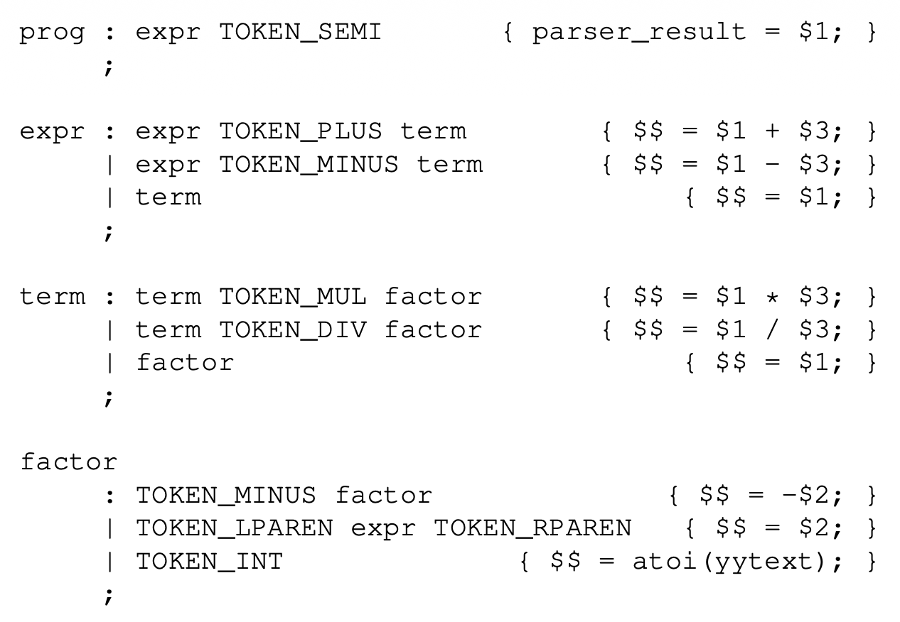

# 5. Parsing in Practice

5.3 Interpretador de Expressões

Para fazer mais do que simplesmente validar o programa, precisamos usar ações semânticas embutidas na própria gramática. Após o lado direito
de qualquer regra de produção, você pode inserir código C arbitrário entre chaves.
Este código pode se referir a valores semânticos que representam 
os valores já calculados para outros não-terminais. 
Os valores semânticos são indicados por
cifrões que apontam a posição de um não-terminal em uma regra de produção.
Dois cifrões indicam o valor semântico da regra atual.

Por exemplo, na regra de adição, a ação semântica apropriada é
adicionar o valor da esquerda (o primeiro símbolo) ao valor da direita 
(o terceiro símbolo):

```expr : expr TOKEN_PLUS term { $$ = $1 + $3; } ```

De onde vêm os valores semânticos $1 e $3? Eles simplesmente
vêm das outras regras que definem esses não-terminais. 
Eventualmente, chegamos a uma regra que fornece o valor para um nó folha. 
Por exemplo, esta regra indica que o valor semântico de um token inteiro é o valor inteiro do texto do token:

```
// lexer
[0-9]+  { yylval = atoi(yytext); return TOKEN_INT; }

// parser
factor : TOKEN_INT { $$ = $1; }```

Ação _default_ para regra com um símbolo à direita:

```term : factor { $$ = $1; } ``` 

Como o Bison gera um  analisador sintático bottom-up, 
ele determina os valores semânticos dos nós-folha na árvore 
sintática primeiro, depois os passa para os nós internos 
e assim por diante,  até que o resultado chegue ao símbolo inicial.

A Figura 5.4 mostra uma gramática Bison que implementa 
um interpretador completo.
O programa principal simplesmente invoca yyparse(). 
Se bem-sucedido, o resultado é armazenado na variável global 
`parser_result`  para extração e uso a partir do programa principal.




